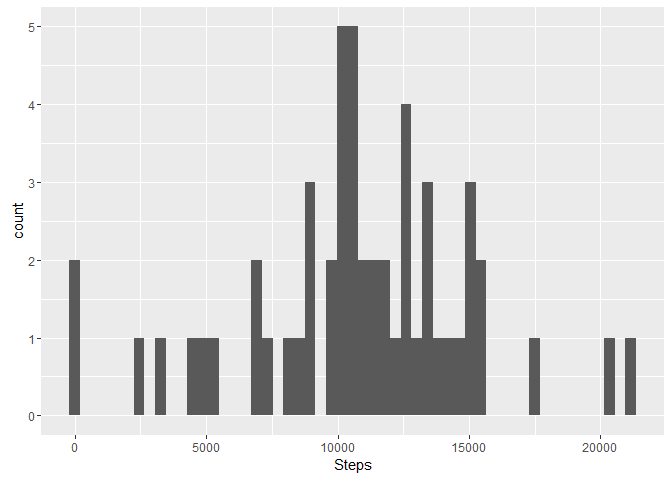
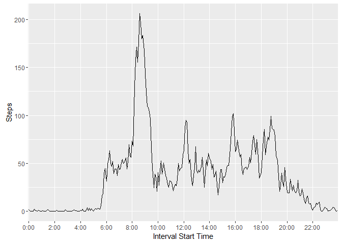
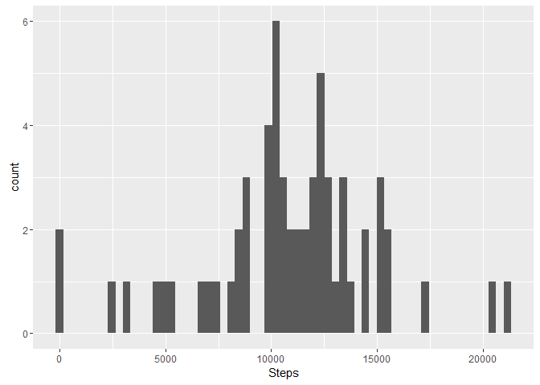
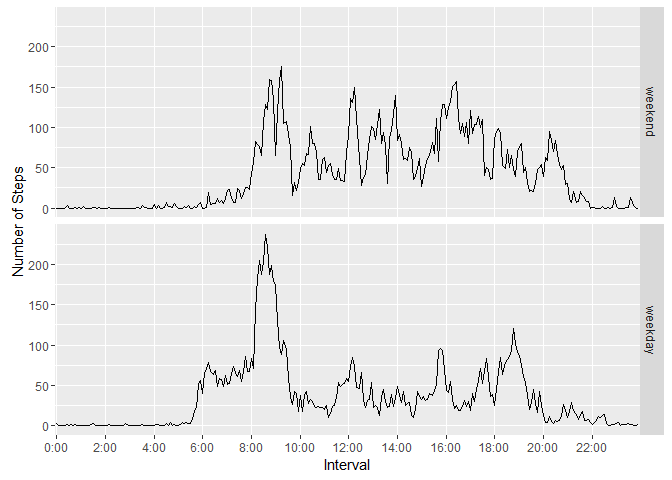

# Reproducible Research: Peer Assessment 1

*Note: While all the R code chunks will be echo'ed, some warnings have been suppressed which will show if the code is run manually.*


## Loading and preprocessing the data


```r
library(ggplot2)
library(dplyr)
fullData <- read.csv("activity.csv")
completeData <- fullData[complete.cases(fullData),]
```

## What is mean total number of steps taken per day?

```r
daily <- aggregate(completeData$steps, list(completeData$date), FUN = sum)
names(daily) <- c("Date", "Steps")
p <- ggplot(daily, aes(x=Steps))
p + geom_histogram(bins = dim(daily)[1])
```

<!-- -->

The mean of the daily steps is 10766.19 while the median is 10765.

## What is the average daily activity pattern?
The average daily activity pattern is filled in by creating a new data set consisting of the mean steps for each interval.  Some massaging is done to the interval start times to make them more readable, and then the whole collection is plotted.


```r
interval <- aggregate(completeData$steps, list(completeData$interval), FUN = mean)
names(interval) <- c("IntervalStart", "Steps")

# Create a helper function for the sapply call
mkTime <- function(t) {
    # convert the time (t) into a array of chars
    tarr <- strsplit(as.character(t), "")[[1]]
    # pad with zeros at the start (so 5 becomes 0:05)
    if(length(tarr) < 3) tarr <- c( rep("0", 3 - length(tarr) ), tarr)
    # break it into the last two (minutes) and the rest (hours) then re-paste
    # with : in between
    paste(
        paste(tarr[-c(length(tarr) - 1, length(tarr))], collapse = ""),
        ":",
        paste(tarr[c(length(tarr) - 1, length(tarr))], collapse = ""),
        sep = ""
    )
}

# add a more readable time for display purposes
interval$Time <- sapply(interval$IntervalStart, mkTime)

#preserve the order based on IntervalStart
interval$Time <- factor(interval$Time, levels = interval$Time[order(interval$IntervalStart)])

# build the plot
p <- ggplot(data = interval, aes(x = Time, y = Steps, group=1)) 
p <- p + geom_line() + labs(x = "Interval Start Time") 
p <- p + scale_x_discrete(breaks = unique(interval$Time)[seq(from = 1, to = 288, by = 24)])

#now display it
p
```

<!-- -->

*Note: In the plot the times are represented in 24 hour time, so 3 pm is 15:00.*

The maximum value of steps is found in the 8:35 interval.

## Imputing missing values

In the full data set there are 2304 NA values for the steps.  These are removed from the graphs and calculations above through the use of the completeData as opposed to the fullData.  By dividing the output of this against the number of intervals in a day (8) we see the number of NA interval values could represent full days.  By running the following code block, we can see that all the NAs are for 8 complete days.


```r
countNA <- function(x) {
    y <- x + 287
    sum(is.na(fullData[x:y,]))
}

which(lapply(seq(from = 1, to = 17568, by = 288), countNA) > 0)
```

```
## [1]  1  8 32 35 40 41 45 61
```

So our method to fill in the missing data needs to fill in full days at a time.  We will add an additional column DoW (Day of the Week) to the dataset, and then take the mean for the correct day and interval to fill in the missing values.


```r
# add the weekdays to the data
fullData$DoW <- sapply(as.Date(fullData$date), weekdays)

# helper function
findMean <- function(num, int, day) {
    # only process the NA values
    if(is.na(num)) {
        # replace the NA with the mean of the same time and day of the week
        num <- mean(fullData[fullData$interval == int & fullData$DoW == day,]$steps, na.rm = TRUE)
    }
    # allow for default rounding to smooth data
    as.integer(num)
}

# apply the function above and overwrite the steps values
fullData$steps <- mapply(findMean, fullData$steps, fullData$interval, fullData$DoW)

# now calculate a histogram of the full data set
fullDaily <- aggregate(fullData$steps, list(fullData$date), FUN = sum)
names(fullDaily) <- c("Date", "Steps")
p <- ggplot(fullDaily, aes(x=Steps))
p + geom_histogram(bins = dim(fullDaily)[1])
```

<!-- -->

The mean of the daily steps is 10809.79 while the median is 11015.  This is different from the first set of values.  The values drifted downwards since we are increaseing the number of signals to divide by without adding substantive increases to the sum.  The sum is increased by the mean each time, but we then throw that value into another calculation of the mean and median.

## Are there differences in activity patterns between weekdays and weekends?

To find if there is a difference in the activity levels on the weekend versus the weekday we need to look at the two data sets independently.  So a new factor is added to the full data, and then based on that two sets of means are calculated.  There is one data frame for weekends and then one for weekdays, which are then combined to one set which is then graphed.


```r
# first mutate to add a variable PoW (Part of the Week)
fullData <- mutate(fullData, PoW = ifelse(DoW %in% c("Saturday", "Sunday"), "weekend", "weekday"))
# make that a factor
fullData$PoW <- factor(fullData$PoW)

# get a list of the intervals from the first day's data
ints <- fullData[seq(from = 0, to = 288, by = 1),]$interval

# calculate the weekend means and save them into a data frame with ints and weekend on all 
vals <- sapply(ints, function(x) {mean(fullData[fullData$PoW == "weekend" & fullData$interval == x,]$steps)})
wknd <- data.frame(intervals = ints, steps = vals, PoW = rep("weekend", 288))

# do the same for weekdays
vals <- sapply(ints, function(x) {mean(fullData[fullData$PoW == "weekday" & fullData$interval == x,]$steps)})
wkdy <- data.frame(intervals = ints, steps = vals, PoW = rep("weekday", 288))

# combine the two into one data frame
aveData <- rbind(wknd, wkdy)

# add a more readable time for display purposes - relies on the mkTime funciton in an above code chunk
aveData$Time <- sapply(aveData$intervals, mkTime)

#preserve the order based on IntervalStart
aveData$Time <- factor(aveData$Time, levels = aveData$Time[order(aveData$intervals)])

# build the graph
pp <- ggplot(data = aveData, aes(x = Time, y = steps, group = 1)) 
pp <- pp + geom_line() + labs(x = "Interval", y = "Number of Steps") 
pp <- pp + scale_x_discrete(breaks = unique(aveData$Time)[seq(from = 1, to = 288, by = 24)])
pp + facet_grid(PoW ~.)
```

<!-- -->

*Note: In the plot the times are represented in 24 hour time, so 3 pm is 15:00.*

The graph shows a clear difference between the weekday and the weekend.  The weekday data has a spike in the morning followed by lower levels of activity, while the weekend shows overall higher levels of activity without the early spike.
